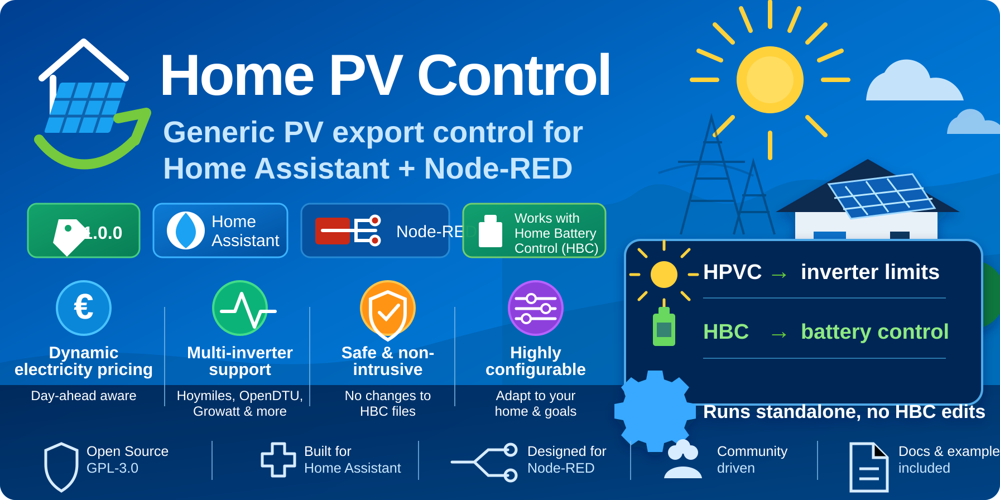

<p align="center">
  
</p>

<p align="center">
  <a href="https://github.com/BioPC/pv-ems-hbc-node-red/releases"></a>
  
  
  
  
</p>

# Home PV Control for HBC


<p align="center">
  <a href="https://docs.homebatterycontrol.com/">📖 HBC Documentation</a> •
  <a href="https://docs.homebatterycontrol.com/02-modbus-setup.html">🔋 Battery Setup</a>
</p>

## Home Battery Control (HBC)

Home PV Control is designed to work alongside Home Battery Control (HBC).

- 🌐 Documentation: https://docs.homebatterycontrol.com/
- 🔋 Battery Setup Guide: https://docs.homebatterycontrol.com/02-modbus-setup.html
- 📚 HBC Wiki: https://docs.homebatterycontrol.com/

Home PV Control manages PV inverter power limits while HBC remains responsible for battery charging, discharging and strategy selection.


**Home PV Control** is a standalone photovoltaic export-control add-on for Home Assistant and Node-RED users who run **Home Battery Control**.

It controls PV inverter power limits while Home Battery Control keeps controlling the batteries.

> Home PV Control does **not** modify Home Battery Control files. It runs next to HBC.

## What it does

Home PV Control dynamically controls writable PV inverter limit entities, for example OpenDTU / Hoymiles power-limit `number` entities.

It is designed for:

- dynamic energy prices
- negative price hours
- avoiding export when export is not wanted
- keeping useful PV for house load
- smoothly increasing PV again when the house starts importing
- systems with one inverter or many inverters

## Features

| Feature | Status |
|---|---:|
| Standalone Node-RED flow | ✅ |
| Home Assistant package helpers | ✅ |
| HBC-style dashboard | ✅ |
| Multi-inverter support | ✅ |
| Per-inverter minimum power | ✅ |
| Proportional PV target split | ✅ |
| Dynamic PV limiting | ✅ |
| Dynamic PV increase on import | ✅ |
| Night restore to full PV | ✅ |
| Optional HBC strategy handoff | ✅ |
| HBC files remain untouched | ✅ |

## Screenshots

Replace these placeholders with real screenshots after installation.

<p align="center">
  
</p>

<p align="center">
  
</p>

## Architecture

```text
                 ┌──────────────────────┐
                 │  Home Battery Control │
                 │  Battery strategies   │
                 └───────────┬──────────┘
                             │
                             ▼
                    Marstek / battery

Tibber / market price ─┐
Grid power sensor ─────┼──► Home PV Control Node-RED flow ───► PV inverter limits
PV power sensor ───────┘
```

Home PV Control may optionally select the HBC strategy, but HBC still performs the battery control.

## Repository structure

```text
home assistant/
  pv_ems_config.yaml      # Home Assistant helpers/package
  pv_ems_dashboard.yaml   # Separate HBC-style dashboard

node-red/
  pv_ems_flow.json        # Node-RED flow

docs/
  01-installation.md
  02-configuration.md
  03-how-it-works.md
  04-troubleshooting.md
  wiki/
```

## Quick install

1. Copy `home assistant/pv_ems_config.yaml` to:

   ```text
   /config/packages/pv_ems_config.yaml
   ```

2. Restart Home Assistant.

3. Import `node-red/pv_ems_flow.json` into Node-RED.

4. Add/import `home assistant/pv_ems_dashboard.yaml` as a separate dashboard.

5. Configure:
   - grid power sensor
   - market/export price sensor
   - all-in import price sensor
   - PV power sensor
   - HBC strategy selector
   - inverters JSON

6. Enable Home PV Control.

See [Installation](docs/01-installation.md).

## Example inverter configuration

```json
[{"n":"PV1","e":"number.inverter1_limit","f":2000,"m":100},{"n":"PV2","e":"number.inverter2_limit","f":1000,"m":50}]
```

The EMS calculates total target PV power and splits it proportionally by `full_power`.

Each inverter is clamped to its own `minimum_power`.

## Default recommended values

| Setting | Recommended |
|---|---:|
| PV Limiting Price | `0.00 €/kWh` |
| Start Limiting Export | `-300 W` |
| Target Export | `-25 W` |
| Import Recalculation | `200 W` |
| Minimum PV Power | `100 W` |
| Night Restore | `10 W` |
| Minimum PV Change | `1 min` |
| Deadband | `25 W` |

## HACS note

This repository is structured to be easy to use with Home Assistant and Node-RED.  
It is **not a normal Python Home Assistant integration**. HACS support would require using this as a custom repository for documentation/files, not as a standard integration install.

See [HACS notes](docs/wiki/HACS.md).

## Documentation

- [Installation](docs/01-installation.md)
- [Configuration](docs/02-configuration.md)
- [How it works](docs/03-how-it-works.md)
- [Troubleshooting](docs/04-troubleshooting.md)
- [Wiki index](docs/wiki/Home.md)
- [Changelog](CHANGELOG.md)

## Roadmap

- More dashboard examples
- Real screenshots
- Node-RED trace/debug dashboard
- Optional helper-based trigger configuration
- Import/export examples for popular inverter brands
- More safety checks around invalid inverter JSON

## Credits

Inspired by the Home Assistant + Node-RED workflow of Home Battery Control.

Home Battery Control: https://github.com/gitcodebob/marstek-venus-rs485-node-red

## License

GPL-3.0-or-later. See [LICENSE](LICENSE).


Note: Home Assistant input_text has a 255-character limit. Use compact inverter keys: `n` name, `e` limit entity, `f` full power, `m` minimum power, `en` enabled. The Node-RED flow also still accepts the long key names for imported JSON.


## Trigger design

Home PV Control evaluates on:

- Every 1 minute: PV limit, restore, negative-price mode and HBC strategy.
- On deploy/startup: one immediate evaluation.
- When Home PV Control settings change: one immediate evaluation.

The package does not use hardcoded grid/PV sensor triggers, so it stays generic for every installation.
