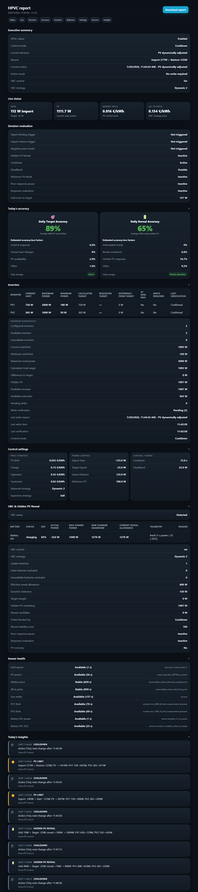

<p align="center">
  
</p>

<p align="center">
  <a href="releases/v1.3.0/release.md"></a>
  <a href="https://www.home-assistant.io/"></a>
  <a href="https://nodered.org/"></a>
  <a href="https://github.com/gitcodebob/marstek-venus-rs485-node-red"></a>
  <a href="LICENSE"></a>
  <a href="https://github.com/BioPC/home-pv-control/stargazers"></a>
</p>

<p align="center">
  <a href="https://www.buymeacoffee.com/YOURUSERNAME">
    
  </a>
  &nbsp;
  <a href="https://paypal.me/YOURUSERNAME">
    
  </a>
</p>
## Requirements

- Home Assistant
- Node-RED
- PV inverter(s) with writable power limit entities
- HBC is optional and only required for battery strategy control
- Home Assistant Sun integration (`sun.sun`) is used when available; otherwise HPVC automatically uses its PV threshold fallback

⚠️ Home PV Control is designed for PV inverters that support external power limit control (curtailment). PV curtailment features require at least one writable inverter power limit entity.


## Home PV Control (HPVC)

**Home PV Control** is a standalone photovoltaic export-control add-on for Home Assistant and Node-RED. It works independently or together with **Home Battery Control (HBC)**.

- 🌐 Documentation for HBC: https://docs.homebatterycontrol.com/

Home PV Control manages PV inverter power limits while HBC remains responsible for battery charging, discharging and strategy selection.

> Home PV Control does **not** modify Home Battery Control files. It runs next to HBC.

## Designed for Dynamic Energy Contracts

Home PV Control is primarily designed for households with dynamic electricity tariffs.
Many of its advanced optimization features are specifically intended for dynamic pricing environments.

## What it does

Home PV Control dynamically controls writable PV inverter limit entities.

It is designed for:

- dynamic energy prices
- negative price hours
- avoiding export when export is not wanted
- keeping useful PV for house load
- smoothly increasing PV again when the house starts importing
- systems with one inverter or many inverters
- HBC systems that charge one or multiple batteries at the same time

## Features

| Feature | Status |
|---|---:|
| Standalone Node-RED flow | ✅ |
| Home Assistant package helpers | ✅ |
| HBC-style dashboard | ✅ |
| Multi-inverter support | ✅ |
| Per-inverter minimum power | ✅ |
| Proportional PV target split | ✅ |
| Dynamic PV limiting | ✅ |
| Dynamic PV increase on import | ✅ |
| `sun.sun` night restore with automatic PV-threshold fallback | ✅ |
| Optional HBC strategy handoff | ✅ |
| Multi-battery Hidden PV Reveal headroom | ✅ |
| HBC files remain untouched | ✅ |

## Architecture

```text
                 ┌───────────────────────┐
                 │  Home Battery Control │
                 │  Battery strategies   │
                 └───────────┬───────────┘
                             │
                             ▼
                    Marstek / battery

Market/full price ─────┐
Grid power sensor ─────┼──► Home PV Control Node-RED flow ───► PV inverter limits
PV power sensor ───────┘
```

Home PV Control may optionally select the HBC strategy, but HBC still performs the battery control.

Hidden PV Reveal sums the reveal allowance of all eligible HBC batteries. Below 90% SOC, allowance follows available charger headroom. From 90% SOC, reveal probes are reduced to 200 W (90–94%), 100 W (95–96%), 50 W (97–98%), 25 W (99%), and 0 W (100%). Each probe is verified before continuing, and the final reveal is limited by Target Export margin, remaining hidden PV, and the internal 800 W safety cap.

Charge priority uses the same adaptive protection. Batteries are managed independently, with hysteresis preventing SOC oscillation. A taper pause affects only the battery that is tapering, allowing lower-SOC batteries to continue charging or revealing normally.

## Quick install

1. Copy `home assistant/hpvc_config.yaml` to:

   ```text
   /config/packages/hpvc_config.yaml
   ```

2. Quick Reload or Restart Home Assistant. 

3. Import `node-red/hpvc_flow.json` into Node-RED and deploy.

4. Add/import `home assistant/hpvc_dashboard.yaml` as a separate dashboard.

5. Configure core entities:
   - grid power sensor
   - market/export price sensor
   - all-in import price sensor
   - PV total power sensor
   - inverter limits

6. Enable Home PV Control.

See [Installation](docs/01-installation.md).

The EMS calculates total target PV power and splits it proportionally by `full_power`.

Each inverter is clamped to its own `minimum_power`.

## Default recommended values

| Setting | Recommended |
|---|---:|
| PV limit price | `0.025 €/kWh` |
| Charge price | `0.10 €/kWh` |
| Expensive price | `0.35 €/kWh` |
| Price hysteresis | `0.02 €/kWh` |
| Export start| `-150 W` |
| Target export | `-25 W` |
| Import restore | `150 W` |
| Min PV for control | `100 W` |
| Night restore PV fallback threshold (used only without `sun.sun`) | `10 W` |
| Cooldown | `60 sec` |
| Deadband | `25 W` |

## Trigger design

Home PV Control evaluates on:

- Every 15 seconds: PV limit, restore, negative-price mode and HBC strategy.
- On deploy/startup: one immediate evaluation.
- When Home PV Control settings change: one immediate evaluation.

## Documentation

- [Installation](docs/01-installation.md)
- [Settings](docs/02-configuration.md)
- [How it works](docs/03-how-it-works.md)
- [Troubleshooting](docs/04-troubleshooting.md)
- [Wiki index](docs/wiki/Home.md)
- [Changelog](CHANGELOG.md)

## Repository structure

```text
home assistant/
  hpvc_config.yaml      # Home Assistant helpers/package
  hpvc_dashboard.yaml   # Separate HBC-style dashboard

node-red/
  hpvc_flow.json        # Node-RED flow

docs/
  01-installation.md
  02-configuration.md
  03-how-it-works.md
  04-troubleshooting.md
  wiki/
```

## Screenshots

### Main Dashboard
The Main tab keeps the top badges, dashboard title, and PV Master Control at the top. Operational information formerly shown on the Debug view—including Decision Details, Live Inputs, HBC status, control graphs, accuracy diagnostics, Price Zones, and Insights—is now shown on Main without requiring the Settings toggle. Existing HPVC- and HBC-dependent visibility remains unchanged.


### Settings
The former Debug view is now the Settings view and uses a cog icon. Press **Settings** in PV Master Control to show or hide all settings on this tab.


### View report


### Node-RED Flow


## HACS note

This repository is structured to be easy to use with Home Assistant and Node-RED.  
It is **not a normal Python Home Assistant integration**. HACS support would require using this as a custom repository for documentation/files, not as a standard integration install.

See [HACS notes](docs/wiki/HACS.md).

## Credits

Inspired by the Home Assistant + Node-RED workflow of Home Battery Control.

Home Battery Control: https://github.com/gitcodebob/marstek-venus-rs485-node-red

## License

GPL-3.0-or-later. See [LICENSE](LICENSE).

## Disclaimer

Home PV Control modifies PV inverter power limits through Home Assistant and Node-RED integrations.

By using this software, you acknowledge that:

* You are responsible for verifying that your inverter, Home Assistant, and Node-RED configuration are compatible and correctly configured.
* Incorrect configuration may result in reduced solar production, unexpected inverter behavior, or failure to achieve the intended energy-management strategy.
* The software is provided "as is" without any warranty of any kind.
* Always test changes in a safe environment before using them in a production energy system.
* The author is not responsible for any financial losses, equipment damage, data loss, regulatory issues, or other consequences resulting from the use of this project.

Use this project at your own risk.