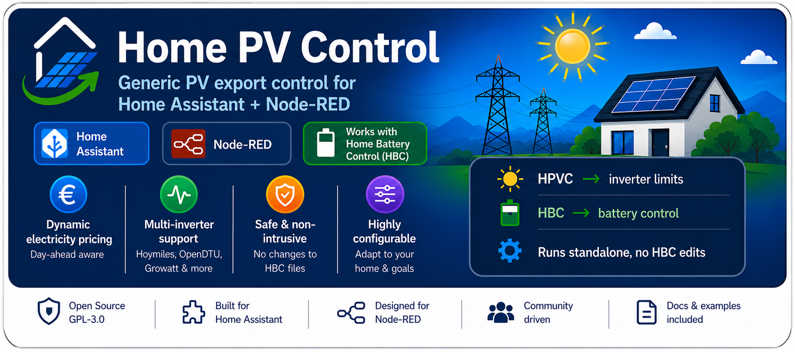
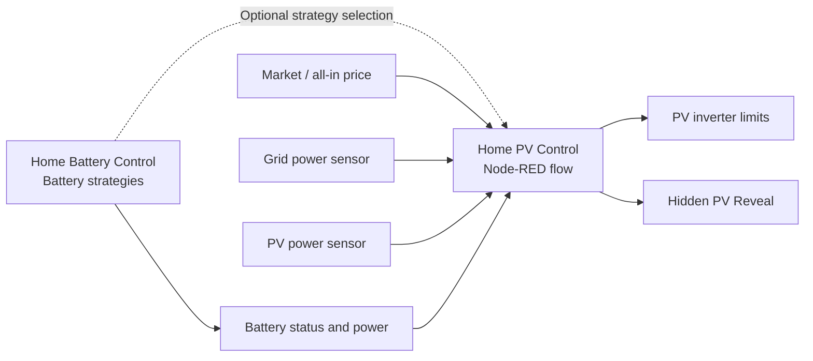
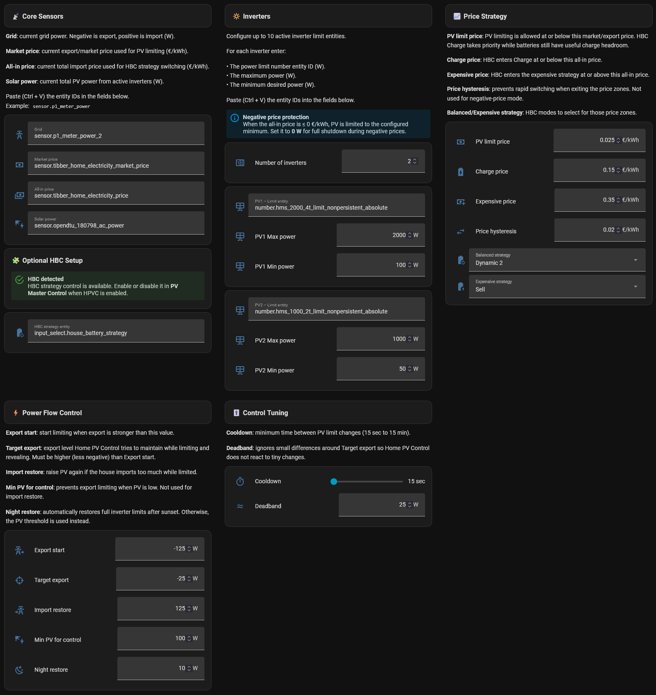
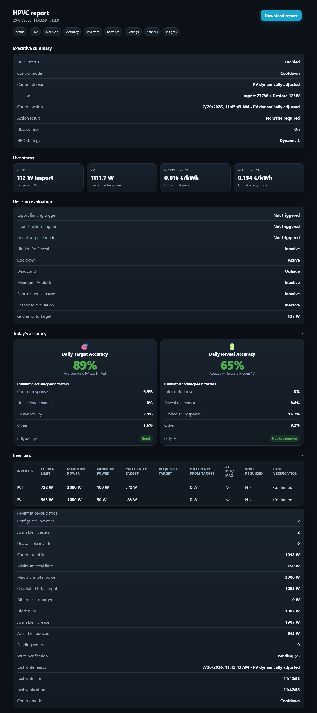
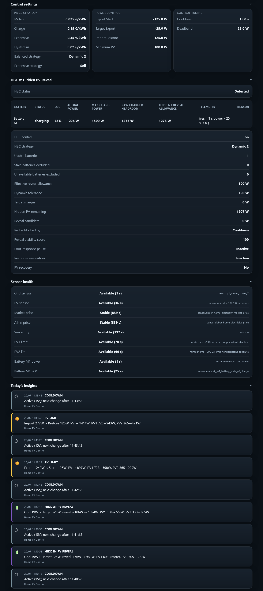
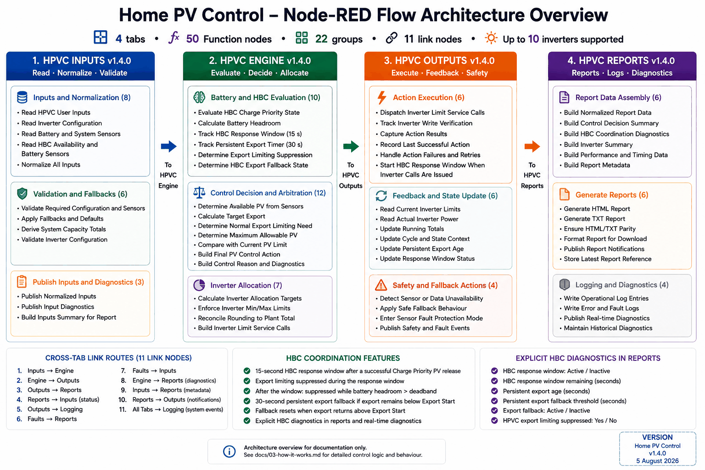

<p align="center">
  
</p>

<p align="center">
  <a href="releases/v1.3.0/release.md"></a>
  <a href="https://www.home-assistant.io/"></a>
  <a href="https://nodered.org/"></a>
  <a href="LICENSE"></a>
  <a href="https://github.com/BioPC/home-pv-control/stargazers"></a>
</p>

<p align="center">
  <a href="https://ko-fi.com/mperez"></a>
  <a href="https://paypal.me/MPerezCabrera"></a>
</p>

# Home PV Control

Home PV Control (HPVC) dynamically limits and restores PV inverter output in Home Assistant using Node-RED. It supports dynamic electricity prices, multiple inverters, optional Home Battery Control integration, and battery-aware Hidden PV Reveal.

- Prevent unwanted or uneconomic PV export
- Preserve useful PV for household consumption
- Restore inverter output automatically when conditions improve
- Operate independently or alongside Home Battery Control

<p align="center">
  <a href="assets/screenshots/dashboard_main.png">
    
  </a>
</p>

> [!IMPORTANT]
> HPVC requires at least one writable inverter power-limit entity exposed to Home Assistant. It does not communicate directly with an inverter; compatibility depends on the Home Assistant integration providing readable PV power and writable limit entities.

## Contents

- [Quick install](#quick-install)
- [Features](#features)
- [Requirements](#requirements)
- [Architecture](#architecture)
- [Shipped defaults](#shipped-defaults)
- [How it evaluates](#how-it-evaluates)
- [Upgrading](#upgrading)
- [Documentation](#documentation)
- [Screenshots](#screenshots)
- [Support](#support)
- [Support the project](#support-the-project)
- [Repository structure](#repository-structure)
- [License](#license)

## Quick install

1. Confirm that Home Assistant packages are enabled in `configuration.yaml`:

   ```yaml
   homeassistant:
     packages: !include_dir_named packages
   ```

2. Copy [`home assistant/hpvc_config.yaml`](home%20assistant/hpvc_config.yaml) to:

   ```text
   /config/packages/hpvc_config.yaml
   ```

3. Reload the supported YAML configuration, or restart Home Assistant.

4. Import [`node-red/hpvc_flow.json`](node-red/hpvc_flow.json) into Node-RED and deploy it.

5. Add [`home assistant/hpvc_dashboard.yaml`](home%20assistant/hpvc_dashboard.yaml) as a separate YAML dashboard or view.

6. Configure the grid-power, Market/export-price, all-in-price, PV-power, and inverter-limit entities in the dashboard.

7. Enable Home PV Control.

See the full [installation guide](docs/01-installation.md), including ApexCharts setup and first-run verification.

## Features

| Feature | Status |
|---|---:|
| Separate HPVC Node-RED flow, independent of HBC | ✅ |
| Home Assistant package helpers | ✅ |
| Ready-to-import Home Assistant dashboard | ✅ |
| Multi-inverter support | ✅ |
| Per-inverter minimum and maximum limits | ✅ |
| Proportional PV target distribution | ✅ |
| Dynamic export limiting and import recovery | ✅ |
| Negative-price handling | ✅ |
| `sun.sun` night restore with PV fallback | ✅ |
| Optional HBC strategy selection | ✅ |
| Multi-battery Hidden PV Reveal | ✅ |
| On-demand HTML and TXT support reports | ✅ |
| HBC files remain untouched | ✅ |

Built-in safeguards include cooldown and deadband handling, per-inverter clamps, invalid-input checks, night restore, and atomic report publication.

## Requirements

- Home Assistant
- Node-RED with the Home Assistant nodes installed
- One or more PV inverters with writable power-limit entities
- ApexCharts Card for the supplied dashboard graphs
- Home Battery Control only for HBC strategy integration and HBC-assisted Hidden PV Reveal

The HPVC control flow itself does not require ApexCharts; ApexCharts is required only by the supplied dashboard graphs.

## Architecture



Home PV Control can optionally select the HBC strategy, but HBC continues to control the batteries. Hidden PV Reveal uses the combined reveal allowance of all eligible HBC batteries.

## Shipped defaults

These values are safe starting points, not universal recommendations. Review them for your inverter, sensor definitions, electricity contract, and local rules.

| Setting | Shipped default |
|---|---:|
| PV limiting price | `0.00 €/kWh` |
| Charge price | `0.10 €/kWh` |
| Expensive price | `0.35 €/kWh` |
| Price hysteresis | `0.02 €/kWh` |
| Export start | `-150 W` |
| Target export | `-25 W` |
| Import restore | `150 W` |
| Min PV for control | `100 W` |
| Night restore PV fallback threshold | `10 W` |
| Cooldown | `60 s` |
| Deadband | `25 W` |

> **PV limiting price guidance:** Use €0.00/kWh with a net export-price sensor. For a raw market-price sensor, adjust for fees, compensation, and local rules.

See [Settings](docs/02-configuration.md#marketexport-price-sensor) for sensor guidance and examples.

## How it evaluates

HPVC evaluates:

- every 15 seconds for limiting, restore, negative-price mode, and HBC strategy decisions;
- once immediately after deploy or startup;
- once when relevant HPVC settings change.

The flow calculates a total target PV output, distributes it proportionally across configured inverters, and clamps every inverter to its configured minimum and maximum. See [How it works](docs/03-how-it-works.md) for the complete decision order and safeguards.

## Upgrading

When upgrading from an older release, keep the Home Assistant package, Node-RED flow, and dashboard on the same version. Review:

- entity-name migration;
- dashboard entity references;
- Node-RED flow replacement;
- restored-default behaviour;
- release-specific compatibility notes.

See the [v1.3.0 release notes](releases/v1.3.0/release.md).

## Documentation

- [Installation](docs/01-installation.md)
- [Settings](docs/02-configuration.md)
- [How it works](docs/03-how-it-works.md)
- [Troubleshooting](docs/04-troubleshooting.md)
- [Changelog](CHANGELOG.md)

For Home Battery Control itself, see the [HBC documentation](https://docs.homebatterycontrol.com/).

## Screenshots

### Settings

Entity selection, inverter configuration, control thresholds, and advanced options.

<p align="center">
  <a href="assets/screenshots/dashboard_settings.png">
    
  </a>
</p>

### View report

On-demand live support report with HTML viewing and TXT download.

<p align="center">
  <a href="assets/screenshots/view_report_top.png">
    
  </a>
  <a href="assets/screenshots/view_report_bottom.png">
    
  </a>
</p>

### Node-RED flow

<p align="center">
  <a href="assets/screenshots/node_red_flow.png">
    
  </a>
</p>

## Support

Before opening an issue:

1. Generate an HPVC support report.
2. Remove private entity names or data you do not want to share.
3. Include the HPVC, Home Assistant, and Node-RED versions.
4. Describe the expected behaviour and what actually happened.

Use [GitHub Issues](https://github.com/BioPC/home-pv-control/issues) for reproducible bugs and feature requests.

## Support the project

Home PV Control is free and open source. If you find it useful, you can support continued development and testing.

<p align="left">
  <a href="https://ko-fi.com/mperez"></a>
  <a href="https://paypal.me/MPerezCabrera"></a>
</p>

GitHub also displays these options through the repository’s **Sponsor** button.

## Repository structure

```text
home assistant/
  hpvc_config.yaml      # Home Assistant package and helpers
  hpvc_dashboard.yaml   # Separate Home Assistant dashboard

node-red/
  hpvc_flow.json        # Node-RED flow

assets/
  screenshots/          # README and documentation images

docs/
  01-installation.md
  02-configuration.md
  03-how-it-works.md
  04-troubleshooting.md
  README.md             # Documentation index

releases/
  v1.3.0/
```

## HACS note

HPVC is not a standard Home Assistant integration. Adding the repository to HACS may expose its files and documentation, but the Home Assistant package, Node-RED flow, and dashboard must still be installed manually.

## Credits

Inspired by the Home Assistant and Node-RED workflow of [Home Battery Control](https://github.com/gitcodebob/marstek-venus-rs485-node-red).

## License

GPL-3.0-or-later. See [LICENSE](LICENSE).

## Disclaimer

Home PV Control modifies PV inverter power limits through Home Assistant and Node-RED integrations.

By using this software, you acknowledge that:

- You are responsible for verifying that your inverter, Home Assistant, and Node-RED configuration are compatible and correctly configured.
- Incorrect configuration may reduce solar production, produce unexpected inverter behaviour, or fail to achieve the intended energy-management strategy.
- The software is provided “as is” without warranty of any kind.
- Always test changes safely before using them in a production energy system.
- The author is not responsible for financial loss, equipment damage, data loss, regulatory issues, or other consequences resulting from use of this project.

Use this project at your own risk.
