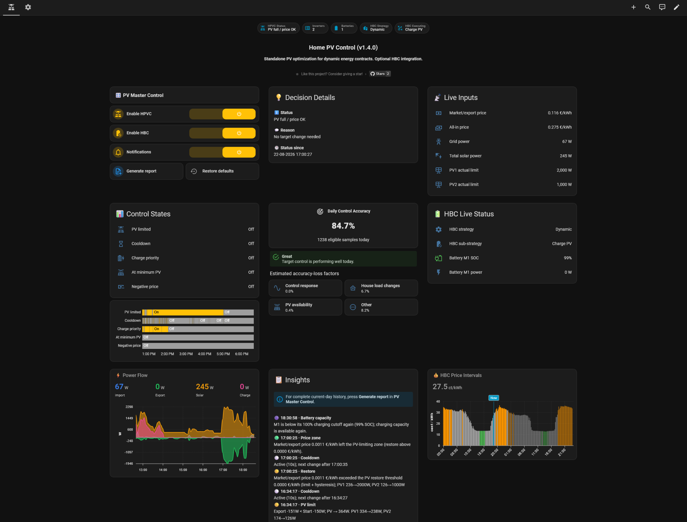
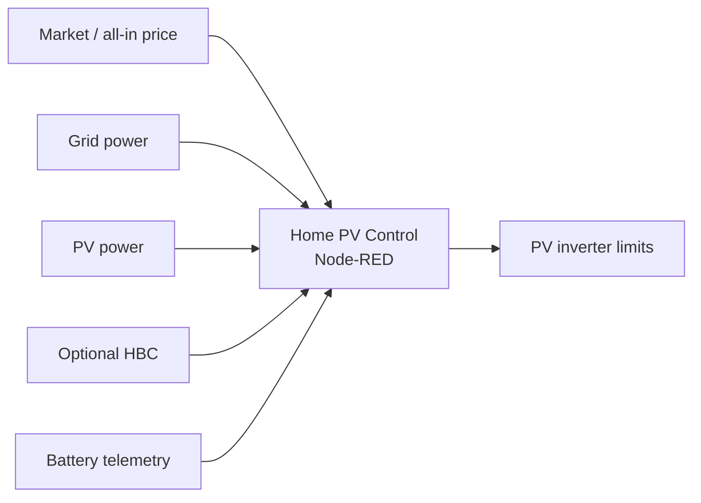
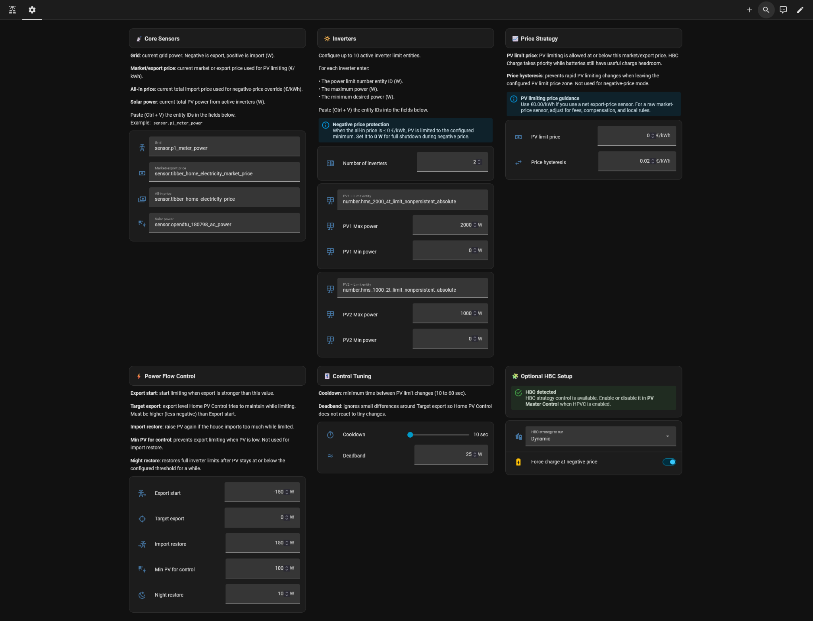

<p align="center">
  
</p>

<p align="center">
  <a href="releases/v1.4.0/release.md"></a>
  <a href="https://www.home-assistant.io/"></a>
  <a href="https://nodered.org/"></a>
  <a href="LICENSE"></a>
  <a href="https://github.com/BioPC/home-pv-control/stargazers"></a>
</p>

<p align="center">
  <a href="https://ko-fi.com/mperez"></a>
  <a href="https://paypal.me/MPerezCabrera"></a>
</p>

# Home PV Control

Home PV Control (HPVC) dynamically limits and restores PV inverter output in Home Assistant through Node-RED. It is designed for dynamic electricity contracts and can run as a standalone PV controller or integrate with Home Battery Control (HBC).



- Reduce unwanted or uneconomic PV export.
- Preserve useful PV for household consumption.
- Restore inverter output automatically when conditions improve.
- Coordinate available PV with optional HBC battery charging.
- Protect against negative all-in prices with minimum-PV control and optional HBC grid charging.

> [!IMPORTANT]
> HPVC requires at least one writable inverter power-limit entity exposed to Home Assistant. It does not communicate directly with an inverter.

## Contents

- [Quick install](#quick-install)
- [Main features](#main-features)
- [HBC permissions](#hbc-permissions)
- [Requirements](#requirements)
- [Shipped defaults](#shipped-defaults)
- [How HPVC works](#how-hpvc-works)
- [Safety and recovery](#safety-and-recovery)
- [Accuracy, Insights and reports](#accuracy-insights-and-reports)
- [Architecture and persistence](#architecture-and-persistence)
- [Upgrading](#upgrading)
- [Documentation](#documentation)
- [Screenshots](#screenshots)
- [Support](#support)
- [Repository structure](#repository-structure)
- [License](#license)

## Quick install

1. Enable Home Assistant packages:

   ```yaml
   homeassistant:
     packages: !include_dir_named packages
   ```

2. Copy [`home assistant/hpvc_config.yaml`](home%20assistant/hpvc_config.yaml) to `/config/packages/hpvc_config.yaml`.
3. Restart Home Assistant or reload the supported YAML configuration.
4. Import [`node-red/hpvc_flow.json`](node-red/hpvc_flow.json) into Node-RED and deploy it.
5. Add [`home assistant/hpvc_dashboard.yaml`](home%20assistant/hpvc_dashboard.yaml) as a YAML dashboard or view.
6. Open the always-visible **Settings** tab and configure the grid-power, market/export-price, all-in-price, PV-power and inverter-limit entities.
7. Wait for first-install validation to complete. HPVC enables automatically once all required live inputs and control settings are valid.

See the full [installation guide](docs/01-installation.md) for dependencies and first-run verification.

## Main features

| Feature | Status |
|---|---:|
| Standalone PV export control | ✅ |
| Dynamic export limiting and import recovery | ✅ |
| Multi-inverter support with per-inverter minimum/maximum limits | ✅ |
| Negative all-in-price minimum-PV protection | ✅ |
| Optional HBC grid charging during negative prices | ✅ |
| Optional HBC Charge Priority for `Charge` / `Charge PV` | ✅ |
| HBC multi-battery support (1–6 batteries) | ✅ |
| Night Restore with PV recovery hysteresis | ✅ |
| Today’s Insights and Power Control history | ✅ |
| Daily Control Accuracy with four loss factors | ✅ |
| On-demand HTML and TXT support reports | ✅ |
| Ready-to-import Home Assistant dashboard | ✅ |

## HBC permissions

**Enable HBC** is the master permission for HPVC to control charging in HBC.

The separate **Force charge at negative price** option only applies while HBC control is enabled.

If HBC permission is removed during an already-active override, HPVC permits only the required restore sequence and then stops HBC writes.

## Requirements

- Home Assistant with package support.
- Node-RED with `node-red-contrib-home-assistant-websocket` **0.80.3 or newer**.
- One or more PV inverters with writable `number.*` power-limit entities.
- A valid grid-power sensor, market/export-price sensor, all-in-price sensor and PV-power sensor.
- ApexCharts Card for the supplied dashboard graphs.
- Home Battery Control only for optional HBC execution tracking and Charge Priority.

## Shipped defaults

These are starting points, not universal recommendations. Review them for your inverter, sensor definitions, electricity contract and local rules.

| Setting | Shipped default |
|---|---:|
| HBC integration / Charge Priority | Off |
| Force charge at negative price | On by default; effective only while HBC control is enabled |
| PV limiting price | `0.00 €/kWh` |
| Price hysteresis | `0.02 €/kWh` |
| Export start | `-150 W` |
| Target export | `0 W` |
| Import restore | `150 W` |
| Min PV for control | `100 W` |
| Night restore PV threshold | `10 W` |
| Cooldown | `30 s` |
| Deadband | `25 W` |


> **PV limiting price guidance:** use €0.00/kWh with a net export-price sensor. For a raw market-price sensor, account for fees, compensation and local rules.

See [Settings](docs/02-configuration.md#marketexport-price-sensor) for sensor guidance and examples.

## How HPVC works

HPVC evaluates:

- every **10 seconds**;
- immediately after deploy/startup;
- when relevant HPVC settings change.

Normal control follows a simple priority order:

1. Validate required inputs and configured inverter limits.
2. Apply negative-price protection when the all-in price is `<= 0`.
3. Handle Night Restore when PV production has effectively ended.
4. Coordinate available PV with HBC Charge Priority when HBC is enabled and eligible.
5. Limit export when price and grid conditions require it.
6. Restore PV when import or price recovery makes more output appropriate.
7. Respect cooldown and deadband so unnecessary writes are avoided.

### HBC Charge Priority

Charge Priority uses HBC execution state, measured battery power and verified battery headroom rather than assuming a selected strategy means charging is active.

- States: **Off, Requested, Waiting, Active**.
- Supports HBC battery order and RS485 eligibility for **1–6 batteries**.
- Multi-battery headroom and taper learning prevent one tapering/full battery from unnecessarily reducing available headroom from another battery.
- A short HBC response window allows HBC to absorb newly released PV before HPVC applies opposite export corrections.
- If confirmed battery charging drops into Waiting, a bounded transition-settle window lets the independent battery controller change state before HPVC reacts to the full transient grid error.
- Small PV corrections remain immediate; large normal corrections and Charge Priority releases are plant-size-relative and staged, with extra damping on the first large reversal.
- Persistent unabsorbed export still falls back to normal PV limiting.

## Safety and recovery

- Required sensors, inverter entities, helper ranges, duplicate entities and threshold relationships are validated before writes.
- Any unavailable configured inverter pauses the complete inverter group.
- Night Restore tolerates expected overnight PV/inverter-limit disappearance but never treats `unknown`/`unavailable` PV as measured zero.
- Battery freshness uses multiple telemetry signals and configured charging/discharging cutoffs.
- Invalid live cutoff values are faults rather than silently replaced defaults.
- HBC-dependent Charge Priority suspends on uncertain battery telemetry while normal PV control can continue where safe.
- Negative-price override state is persisted and restored safely across restart/deploy.
- Recovery paths require confirmed healthy data before dependent control resumes.

## Accuracy, Insights and reports

### Daily Control Accuracy

Daily Control Accuracy measures how closely grid power follows the requested target and exposes four headline loss factors:

- **Control response**
- **House load changes**
- **PV availability**
- **Other**

The factor values represent estimated percentage contributions to the headline accuracy loss and reconcile to `100 − Daily Control Accuracy`.

HPVC uses a short physical-event reconciliation window so delayed PV, battery and inverter-limit telemetry can still be associated with the grid event that caused the loss without delaying control. Detailed raw attribution, continuity and engineering metrics remain available in the support report.

### Today’s Insights and Power Control

- Insights focus on meaningful transitions, warnings, faults and recoveries.
- HBC-only safety pauses remain distinguishable from full HPVC control blocks.
- Power Control history records current-day control activity and retains enough rows for a full day at the 10-second cadence.

### Support reports

On-demand HTML/TXT reports include:

- current HPVC decision and control mode;
- inverter state and calculated targets;
- required sensor health;
- HBC strategy/execution and Charge Priority state;
- battery eligibility, headroom and taper diagnostics;
- negative-price override state;
- Daily Control Accuracy and attribution diagnostics;
- Today’s Insights and Power Control history.

Reports are generated from one shared fresh model and published atomically. Non-structural parity warnings no longer block **View report**; structural/shared-model failures still do.

## Architecture and persistence



The Node-RED flow is organized into four functional tabs. Current-day Insights, Power Control, Daily Control Accuracy and negative-price override state share the private `hpvc-data/runtime-history.json` journal.

Journal writes are serialized and guarded against stale completions. Runtime waits for current-day restoration before dependent actions continue, which avoids startup/redeploy races.

## Upgrading

When upgrading, keep the Home Assistant package, Node-RED flow and dashboard on the same release version.

1. Back up the current package, dashboard, Node-RED flow and `hpvc-data` journal.
2. Replace the Home Assistant package.
3. Replace the complete Node-RED flow.
4. Replace or merge the dashboard.
5. Restart Home Assistant and deploy Node-RED.
6. Verify configured sensors and inverter limits.
7. Review **Force charge at negative price**. It is seeded **On** once on fresh installs and upgrades. After that, a manual Off choice survives normal Home Assistant restarts and package/automation reloads. **Restore defaults** turns it On again.
8. Generate a support report to confirm the installation is healthy.

See the [v1.4.0 release notes](releases/v1.4.0/release.md) for the full release summary.

## Documentation

- [Installation](docs/01-installation.md)
- [Settings](docs/02-configuration.md)
- [How it works](docs/03-how-it-works.md)
- [Troubleshooting](docs/04-troubleshooting.md)
- [Documentation index](docs/README.md)
- [Changelog](CHANGELOG.md)
- [v1.4.0 release notes](releases/v1.4.0/release.md)

For Home Battery Control itself, see the [HBC documentation](https://docs.homebatterycontrol.com/).


## Screenshots

### Settings



### Node-RED flow

Current v1.4.0 Node-RED architecture overview generated from the shipped flow.


## Support

The HTML support report is published at `/local/hpvc/support-report.html`.

Before opening an issue:

1. Generate an HPVC support report.
2. Remove private entity names or data you do not want to share.
3. Include the HPVC, Home Assistant and Node-RED versions.
4. Describe the expected behavior and what actually happened.

Use [GitHub Issues](https://github.com/BioPC/home-pv-control/issues) for reproducible bugs and feature requests.

## Support the project

Home PV Control is free and open source. If you find it useful, you can support continued development.

<p align="left">
  <a href="https://ko-fi.com/mperez"></a>
  <a href="https://paypal.me/MPerezCabrera"></a>
</p>

## Repository structure

```text
home assistant/
  hpvc_config.yaml      # Home Assistant package and helpers
  hpvc_dashboard.yaml   # Separate Home Assistant dashboard

node-red/
  hpvc_flow.json        # Importable Node-RED flow with four v1.4.0 tabs

examples/
  hoymiles-opendtu-2-inverters.reference.json

assets/
  banner.png
  logo.svg
  screenshots/
    node_red_flow.png

docs/
  01-installation.md
  02-configuration.md
  03-how-it-works.md
  04-troubleshooting.md
  README.md

releases/
  v1.3.0/
  v1.4.0/
```

## Installation format

HPVC is distributed as a manual GitHub release ZIP, not as a HACS custom integration, plugin, theme or template repository. Install the Home Assistant package, Node-RED flow and dashboard manually as described above.

## Credits

Inspired by the Home Assistant and Node-RED workflow of [Home Battery Control](https://github.com/gitcodebob/marstek-venus-rs485-node-red).

## License

GPL-3.0-or-later. See [LICENSE](LICENSE).

## Disclaimer

Home PV Control modifies PV inverter power limits through Home Assistant and Node-RED integrations.

By using this software, you acknowledge that:

- You are responsible for verifying that your inverter, Home Assistant and Node-RED configuration are compatible and correctly configured.
- Incorrect configuration may reduce solar production, produce unexpected inverter behavior or fail to achieve the intended energy-management strategy.
- The software is provided “as is” without warranty of any kind.
- Always verify configuration changes safely before using them in a production energy system.
- The author is not responsible for financial loss, equipment damage, data loss, regulatory issues or other consequences resulting from use of this project.

Use this project at your own risk.
